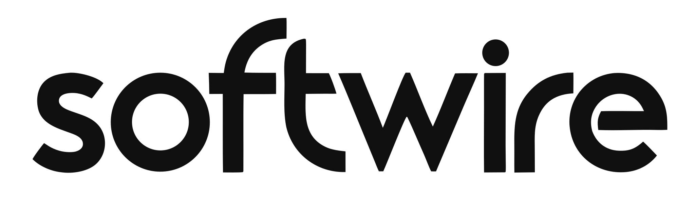

<p>
  
</p>

<h1>Agents Can Access Desktop Software</h1>

<table>
  <tr>
    <td width="50%" valign="top">
      
    </td>
    <td width="50%" valign="top">
      <strong>A tiny bridge that lets your coding harness drive professional desktop software — Photoshop, Premiere, Blender, Unity, and more — directly from the shell.</strong>
      <br /><br />
      SoftWire gives agentic harnesses — Codex, Claude Code, Gemini CLI, OpenCode and the likes — direct access to the scripting APIs inside professional desktop software. One <code>pip install softwire && softwire setup</code> covers many apps across Adobe Creative Cloud, Autodesk, Microsoft Office, and game engines.
      <br /><br />
      <a href="docs/mcp.md">SoftWire is not an MCP server</a>. The agent sends a script through a small bridge command, the bridge runs it inside the app's own automation runtime, and the app returns JSON.
      <pre><code>agent shell -> bridge command -> app scripting runtime -> JSON result</code></pre>
      This is done without brittle screenshots and without schema definitions. The bridge exposes the scripting layer already built into each application.
    </td>
  </tr>
</table>

## Installation

```powershell
pip install softwire
```

Then register SoftWire with your local agent harness:

```powershell
softwire setup
```

This detects your harnesses and informs them that SoftWire exists. For first-run checks, source checkout commands, and app-specific prerequisites, see [Setup and commands](docs/setup.md).

## Current Adapters


| App           | Adapter                  | Runtime                                          |
| --------------- | -------------------------- | -------------------------------------------------- |
| Photoshop     | `photoshop_adapter/`     | COM to ExtendScript                              |
| InDesign      | `indesign_adapter/`      | COM to ExtendScript                              |
| Illustrator   | `illustrator_adapter/`   | COM to ExtendScript                              |
| Word          | `word_adapter/`          | COM object model                                 |
| Excel         | `excel_adapter/`         | COM object model                                 |
| PowerPoint    | `powerpoint_adapter/`    | COM object model                                 |
| Premiere Pro  | `premiere_adapter/`      | CEP localhost to ExtendScript                    |
| After Effects | `after_effects_adapter/` | CEP localhost to ExtendScript                    |
| Audition      | `audition_adapter/`      | CEP localhost to ExtendScript                    |
| Blender       | `blender_adapter/`       | Addon localhost to `bpy`                          |
| Unity         | `unity_adapter/`         | Editor package to `UnityEditor` and `UnityEngine` |
| 3ds Max       | `3dsmax_adapter/`        | Startup Python localhost to MAXScript             |
| Houdini       | `houdini_adapter/`       | Startup Python localhost to `hou`                 |

## More Docs

- [Setup and commands](docs/setup.md)
- [Harness support and discoverability](docs/harenesses.md)
- [Wait, isn't this called MCP?](docs/why-shell-adapters.md)

### Documentation for Agents

- [How the Adapters work](docs/ADAPTER_SPEC.md)
- [How to use the Bridge Contracts](shared/bridge-contract.md)
- [How to Work Together with a Human](shared/coexistence.md)
- [Known Issues](docs/known-issues.md)
